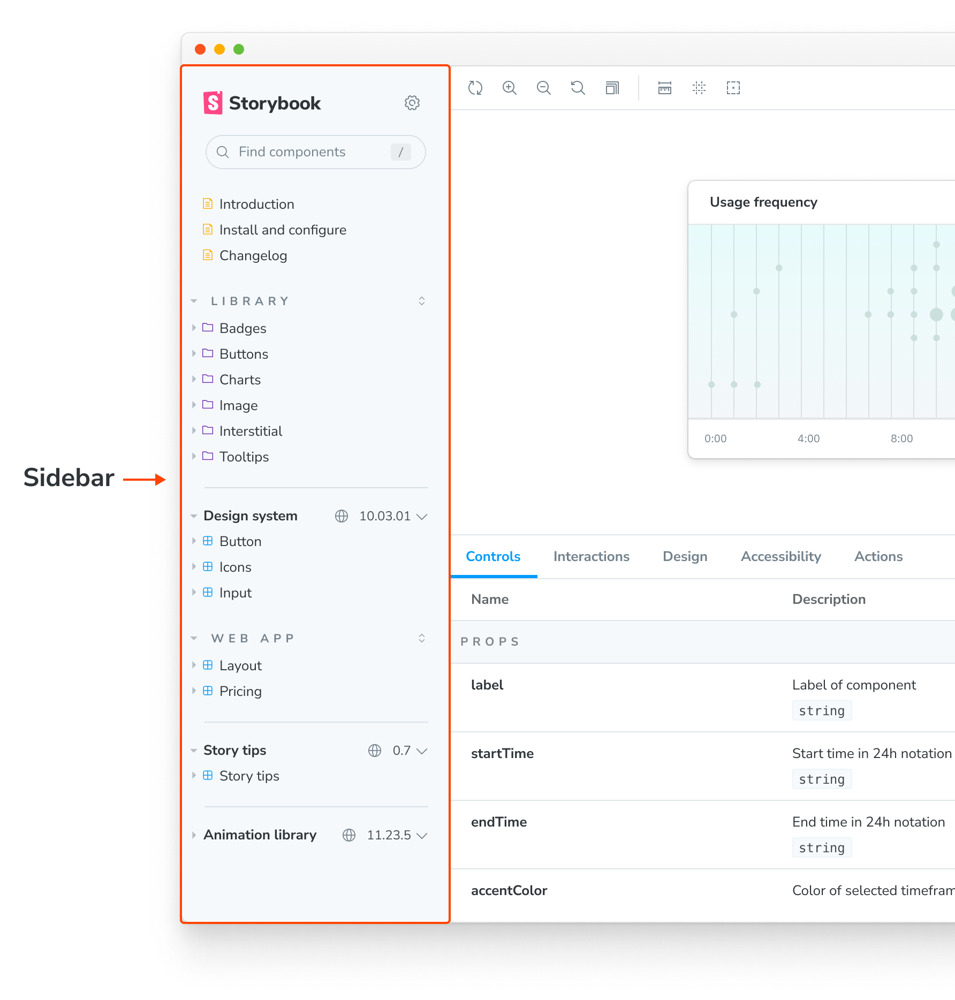
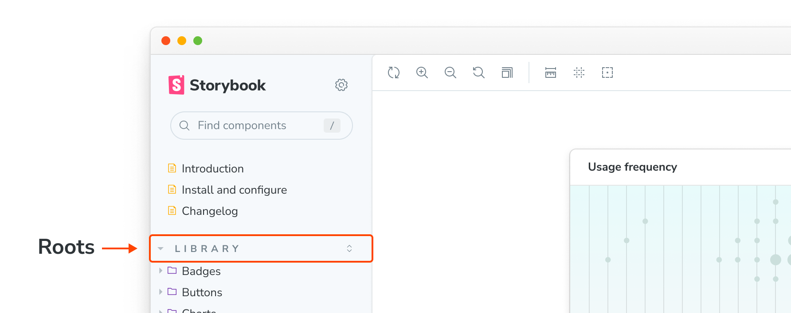

Storybook’s sidebar lists all your stories grouped by component. When you have many components, you may also wish to group those components. To do so, you can add the `/` separator to the `title` of your CSF file, and Storybook will group the stories into groups based on common prefixes:

We recommend using a nesting scheme that mirrors the filesystem path of the components. For example, if you have a file `components/modals/Alert.js`, name the CSF file `components/modals/Alert.stories.js` and title it `Components/Modals/Alert`.

## Roots

By default, Storybook will treat your top-level nodes as “roots”. Roots are displayed in the UI as “sections” of the hierarchy. Lower level groups will show up as folders:

If you’d prefer to show top-level nodes as folders rather than roots, you can set the `sidebar.showRoots` option to `false` in [`./storybook/manager.js`](./overview.md#configure-story-rendering):

<!-- prettier-ignore-start -->

<CodeSnippets
  paths={[
    'common/storybook-manager-disable-roots.js.mdx',
  ]}
/>

<!-- prettier-ignore-end -->

## Permalink to stories

By default, Storybook generates an `id` for each story based on the component title and the story name. This `id` in particular is used in the URL for each story, and that URL can serve as a permalink (primarily when you [publish](../sharing/publish-storybook.md) your Storybook).

Consider the following story:

<!-- prettier-ignore-start -->

<CodeSnippets
  paths={[
    'angular/foo-bar-baz-story.ts.mdx',
    'web-components/foo-bar-baz-story.js.mdx',
    'web-components/foo-bar-baz-story.ts.mdx',
    'common/foo-bar-baz-story.js.mdx',
    'common/foo-bar-baz-story.ts.mdx',
  ]}
  usesCsf3
  csf2Path="configure/sidebar-and-urls#snippet-foo-bar-baz-story"
/>

<!-- prettier-ignore-end -->

Storybook's ID-generation logic will give this the `id` `foo-bar--baz`, so the link would be `?path=/story/foo-bar--baz`.

It is possible to manually set the story's id, which is helpful if you want to rename stories without breaking permalinks. Suppose you want to change the position in the hierarchy to `OtherFoo/Bar` and the story name to `Moo`. Here's how to do that:

<!-- prettier-ignore-start -->

<CodeSnippets
  paths={[
    'angular/other-foo-bar-story.ts.mdx',
    'web-components/other-foo-bar-story.js.mdx',
    'web-components/other-foo-bar-story.ts.mdx',
    'common/other-foo-bar-story.js.mdx',
    'common/other-foo-bar-story.ts.mdx',
  ]}
  usesCsf3
  csf2Path="configure/sidebar-and-urls#snippet-other-foo-bar-story"
/>

<!-- prettier-ignore-end -->

Storybook will prioritize the `id` over the title for ID generation if provided and prioritize the `story.name` over the export key for display.

## CSF 3.0 auto-titles

Storybook 6.4 introduced [CSF 3.0](https://storybook.js.org/blog/component-story-format-3-0/) as an experimental feature, allowing you to write stories more compactly. Suppose you're already using this format to write your stories. In that case, you can omit the `title` element from the default export and allow Storybook automatically infer it based on the file's physical location. For example, given the following configuration and story:

<!-- prettier-ignore-start -->

<CodeSnippets
  paths={[
    'common/storybook-main-configuration-src-dir.main-js.js.mdx',
    'common/storybook-main-configuration-src-dir.main-ts.ts.mdx',
    'angular/component-story-auto-title.csf3-story-ts.ts.mdx',
    'web-components/component-story-auto-title.csf3-story-ts.js.mdx',
    'web-components/component-story-auto-title.csf3-story-ts.ts.mdx',
    'common/component-story-auto-title.csf3-story.js.mdx',
    'common/component-story-auto-title.csf3-story-ts.ts.mdx',
  ]}
/>

<!-- prettier-ignore-end -->

When Storybook loads, the story can show up in the sidebar as `components/My Component`.

### Auto-title filename case

Starting with Storybook 6.5, story titles generated automatically no longer rely on Lodash's [startCase](https://lodash.com/docs/#startCase).
Instead, the file name casing is preserved, allowing additional control over the story title. For example, `components/My Component` will be defined as `components/MyComponent`.

If you need, you can revert to the previous pattern by adding the following configuration:

<!-- prettier-ignore-start -->

<CodeSnippets
  paths={[
    'common/storybook-manager-render-label-stories.js.mdx',
  ]}
/>

<!-- prettier-ignore-end -->

### Auto-title redundant filenames

In addition to improvements to the story file name casing, a new heuristic was introduced, removing redundant names in case the filename has the same name as the directory name, or if it's called `index.stories.js|ts`. For example, before `components/MyComponent/MyComponent.stories.js` was defined as `Components/MyComponent/MyComponent` in the sidebar. Now it will be defined as `Components/MyComponent`.

If you need to preserve the naming scheme, you can add the `title` element to the default export. For example:

<!-- prettier-ignore-start -->

<CodeSnippets
  paths={[
    'angular/storybook-csf-3-auto-title-redundant.ts.mdx',
    'common/storybook-csf-3-auto-title-redundant.js.mdx',
    'common/storybook-csf-3-auto-title-redundant.ts.mdx',
  ]}
  usesCsf3
/>

<!-- prettier-ignore-end -->

### Auto-title prefixes

Additionally, if you customize your Storybook to load your stories based on a [configuration object](./overview.md#with-a-configuration-object), including a `titlePrefix`, Storybook automatically prefixes all titles to matching stories. For example, assuming you have the following configuration:

<!-- prettier-ignore-start -->

<CodeSnippets
  paths={[
    'common/storybook-main-auto-title-custom.js.mdx',
    'common/storybook-main-auto-title-custom.ts.mdx',
  ]}
/>

<!-- prettier-ignore-end -->

When Storybook generates the titles for all matching stories, they'll retain the `Custom` prefix.

### Story Indexers

Story Indexers are a set of heuristics used by Storybook to crawl your filesystem based on a given glob pattern searching for matching stories, which is then used to generate an index.json (formerly stories.json) file responsible for populating the sidebar with the necessary information. By default, this heuristic will look for files that contain the following scheme \*.stories.@(js|jsx|ts|tsx). However, if you need, you can create your custom story indexer that you can use to include stories that have a different naming convention. For example:

<!-- prettier-ignore-start -->

<CodeSnippets
  paths={[
    'common/storybook-main-csf-indexer.ts.mdx',
  ]}
/>

<!-- prettier-ignore-end -->

### Processing custom titles

Out of the box, Storybook automatically infers the story's title based on a set of patterns, including, for example, the file's physical location. If you're working on creating a custom story indexer and you want to handle the titles based on your set of rules, you can adjust it and provide a `makeTitle` function inside the `loadCsf` function. Below is a condensed table and examples of how these patterns work and how they relate to stories.

| Pattern        | Description                                                                                                                                    |
| -------------- | ---------------------------------------------------------------------------------------------------------------------------------------------- |
| `titlePrefix`  | Prefixes the indexed story title based on the [configuration](./overview.md#with-a-configuration-object).                                      |
| `title`        | Requires CSF and MDX. Infers the story title based on the information defined in the metadata.                                             |
| `name`         | Requires CSF and MDX.  Overrides the story title based on the provided [name](../writing-stories/introduction.md#rename-stories) property. |
| `component`    | Requires CSF.  Generates the title based on the component property defined in the metadata.                                                |
| `of`           | Requires MDX.  Retrieves the title based on the referenced story file.                                                                     |
| `story export` | Requires CSF.   Defines the title based on the [named story export](../api/csf.md#named-story-exports).                                    |
| `filename`     | Enabled with custom indexers.  Defines the story title based on the filename parsed with the indexer.                                      |

<!-- prettier-ignore-start -->

<CodeSnippets
  paths={[
    'common/csf-3-example-title.ts.mdx',
    'common/csf-3-example-title.mdx.mdx',
  ]}
/>

<!-- prettier-ignore-end -->

<!-- prettier-ignore-start -->

<CodeSnippets
  paths={[
    'common/storybook-main-story-indexer-main.ts.mdx'
  ]}
/>

<!-- prettier-ignore-end -->

💡 Story indexers are a great way to get non-developers playing with your components and stories. They can do much more than documented here; we encourage you to check out the [`@storybook-extras/markdown` ](https://storybook.js.org/addons/@storybook-extras/markdown/) to learn more about these techniques.

