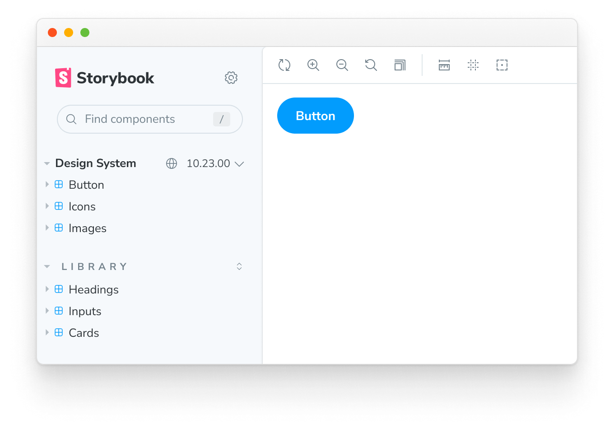

Storybook is widely used by component libraries and design systems. Design system authors can automatically compose their design systems inside their consumer’s Storybooks.

For example, if you use a design system package, its stories can appear alongside your own. That makes it convenient to cross reference usage documentation without leaving Storybook.

<div class="aside">

Composition via a package requires a secure integration between the service where you publish Storybook and Storybook’s own APIs. We recommend [publishing Storybook to Chromatic](./publish-storybook.md#publish-storybook-with-chromatic) for full support of these features.

</div>

## For consumers

Composition happens automatically if the package [supports](#for-authors) it. When you install the package, Storybook will load its stories alongside your own.


### Set up

If you want to configure how the composed Storybook behaves, you can disable the `ref` element in your [`.storybook/main.js`](../configure/overview.md#configure-story-rendering)

<!-- prettier-ignore-start -->

<CodeSnippets
  paths={[
    'common/storybook-main-disable-refs.js.mdx',
    'common/storybook-main-disable-refs.ts.mdx',
  ]}
/>

<!-- prettier-ignore-end -->

### Switching versions

Change the version of the composed Storybook to see how the library evolves. This requires [configuration](#show-a-version-selector) from the package author.



## For authors

Component library authors can expand adoption by composing their components in their consumer’s Storybooks.

Add a `storybook` property in your published `package.json`that contains an object with a `url` field. Point the URL field to a published Storybook at the version you want.

```json
// Your component library’s package.json
{
  "storybook": {
    "url": "https://host.com/your-storybook-for-this-version"
  }
}
```

### Automatic version selection

If you're using [Chromatic](./publish-storybook.md#publish-storybook-with-chromatic), you can provide a single URL for your Storybook in the `storybook.url` field. You do not need to change the URL each time you publish a new version. Storybook will automatically find the correct URL for your package. For example:

```json
{
  "storybook": {
    "url": "https://master--xyz123.chromatic.com"
  }
}
```

In this example `xyz123` is your Chromatic project id. Storybook will automatically compose in the Storybook published to that project corresponding to the version the user has installed.

### Show a version selector

If you're using [Chromatic](./publish-storybook.md#publish-storybook-with-chromatic), you can provide a list of versions for the user to [choose from](#switching-versions) to experiment with other versions of your package.
